# 🤖 Automated Workflows Guide

**Opción A: Automatización Moderada - 70% menos trabajo manual**

---

## 📋 Overview

Este sistema consta de **8 workflows** que trabajan en conjunto:

### Core Workflows (Manual)
1. 🎯 **Bounty Hunter** - Busca bounties cada 6h
2. 🔔 **Bounty Notifications** - Alertas de alto valor cada 3h
3. 📊 **My Bounty Tracker** - Tracking manual on-demand

### Automated Workflows (NEW!)
4. 🤖 **Auto-Claim Assistant** - Reclama bounties con tu aprobación
5. 📁 **Workspace Setup Bot** - Configura entorno automáticamente
6. 📊 **Smart Commit Detector** - Detecta commits y actualiza tracker
7. ⏰ **Deadline Monitor** - Monitorea tiempos y alertas
8. 💰 **Payment Verifier** - Rastrea pagos y recordatorios

---

## 🔄 Flujo Completo Automatizado

```mermaid
graph TD
    A[🎯 Bounty Hunter<br/>Every 6h] -->|Finds bounties| B[bounty-opportunities.json]

    B --> C{High value?<br/>Score >7?}

    C -->|Yes| D[🔔 Bounty Notifications<br/>Every 3h]
    D --> E[You review & decide]

    E -->|Approve| F[🤖 Auto-Claim Assistant]
    F -->|Comments on issue| G[Bounty claimed]
    F -->|Updates tracker| H[Status: claimed]

    H --> I[📁 Workspace Setup Bot]
    I -->|Forks repo| J[Local workspace]
    I -->|Installs deps| J
    I -->|Creates branch| J
    I -->|Updates tracker| K[Status: in_progress]

    K --> L[You code...]

    L --> M[📊 Smart Commit Detector<br/>Every 12h]
    M -->|Detects commits| N{PR opened?}
    N -->|Yes| O[Status: submitted]
    N -->|No| P[Status: in_progress]

    O --> Q{PR merged?}
    Q -->|Yes| R[Status: completed]

    R --> S[💰 Payment Verifier<br/>Daily]
    S -->|Checks issue comments| T{Payment mentioned?}
    T -->|Yes| U[Alerts you to confirm]
    T -->|No, >7 days| V[Creates reminder issue]

    U --> W[You confirm payment]
    W --> X[Status: paid]

    P --> Y[⏰ Deadline Monitor<br/>Daily]
    Y -->|No activity >7d| Z[Alert issue created]

    style A fill:#4CAF50
    style D fill:#FF9800
    style F fill:#2196F3
    style I fill:#9C27B0
    style M fill:#00BCD4
    style S fill:#FFC107
    style Y fill:#F44336
```



---

## 📚 Workflow Details

### 1. 🤖 Auto-Claim Assistant

**File:** `.github/workflows/auto-claim-assistant.yml`

**Purpose:** Analiza y reclama bounties con tu aprobación

**Triggers:**
- Manual dispatch
- Repository dispatch (from high-value alerts)

**What it does:**
1. Analyzes bounty (score 0-10)
2. Checks: amount, tech stack, competition, assignees
3. Recommends claim if score ≥7, amount ≥$100, not assigned
4. If you approve: Comments on issue to claim
5. Updates tracker to "claimed"

**How to use:**
```bash
# Go to: Actions → Auto-Claim Assistant → Run workflow
# Input:
#   - bounty_url: https://github.com/owner/repo/issues/123
#   - auto_approve: no (review first) or yes (claim immediately)
```

**Safety:**
- ✅ Approval required by default
- ✅ Only claims if score ≥7
- ✅ Shows full analysis before claiming

---

### 2. 📁 Workspace Setup Bot

**File:** `.github/workflows/workspace-setup-bot.yml`

**Purpose:** Configura tu workspace local automáticamente

**Triggers:**
- Manual dispatch

**What it does:**
1. Generates setup script for the bounty
2. Can fork + clone, clone only, or just give instructions
3. Creates branch: `bounty-issue-{number}`
4. Installs dependencies (npm/yarn/cargo/pip/etc)
5. Downloads issue details to BOUNTY-ISSUE.md
6. Updates tracker to "in_progress"

**How to use:**
```bash
# Go to: Actions → Workspace Setup Bot → Run workflow
# Input:
#   - bounty_url: https://github.com/owner/repo/issues/123
#   - setup_mode: info_only | clone_only | fork_and_clone
```

**Modes:**
- `info_only`: Just generates commands for you
- `clone_only`: Clones original repo
- `fork_and_clone`: Forks to your account + clones

**Output:**
- Downloads artifact with `setup-bounty-{num}.sh` script
- Or follow manual instructions in summary

---

### 3. 📊 Smart Commit Detector

**File:** `.github/workflows/smart-commit-detector.yml`

**Purpose:** Detecta automáticamente commits/PRs en bounties activos

**Triggers:**
- Schedule: Every 12 hours
- Manual dispatch

**What it does:**
1. Loads active bounties from tracker
2. Checks each repo for:
   - PRs from you related to the issue
   - Recent commits in your fork
3. Auto-updates status:
   - Commits found → "in_progress"
   - PR opened → "submitted"
   - PR merged → "completed"
4. Commits changes to tracker

**Automatic updates:**
- ✅ claimed → in_progress (when commits detected)
- ✅ in_progress → submitted (when PR opened)
- ✅ submitted → completed (when PR merged)

**No manual action needed!**

---

### 4. ⏰ Deadline Monitor

**File:** `.github/workflows/deadline-monitor.yml**

**Purpose:** Monitorea tiempos y te alerta de bounties atrasados

**Triggers:**
- Schedule: Daily at 9 AM UTC
- Manual dispatch

**What it does:**
1. Checks all active bounties
2. Calculates:
   - Days since claimed
   - Days since last activity
3. Categorizes:
   - 🚨 OVERDUE: No activity >7 days
   - ⚠️ WARNING: Claimed >14 days OR no activity >3 days
   - ✅ ON TRACK: Everything else
4. Creates alert issue if bounties overdue
5. Recommends which bounty to prioritize today

**Alerts:**
- 🚨 Creates GitHub issue if >7 days without activity
- Daily summary shows priority recommendations
- Suggests abandoning stuck bounties

---

### 5. 💰 Payment Verifier

**File:** `.github/workflows/payment-verifier.yml`

**Purpose:** Rastrea pagos y te recuerda solicitar pago

**Triggers:**
- Schedule: Daily at 10 AM UTC
- Manual dispatch (to confirm payment)

**What it does:**
1. Checks all "completed" bounties
2. Scans issue comments for payment keywords
3. Calculates days since completion
4. Actions:
   - Payment comment found → Alerts you to confirm
   - >7 days, no payment → Creates reminder issue
   - <7 days → Waits patiently
5. Updates to "paid" when you confirm

**Manual confirmation:**
```bash
# Go to: Actions → Payment Verifier → Run workflow
# Input:
#   - bounty_url: https://github.com/owner/repo/issues/123
#   - confirm_payment: yes
```

**Payment keywords detected:**
- "paid", "payment sent", "bounty paid", "transferred", "sent you"

---

## 🎯 Complete Workflow Example

### Day 1: Discovery
```
09:00 - 🎯 Bounty Hunter runs (automatic)
        Finds 15 bounties, saves to bounty-opportunities.json

12:00 - 🔔 Bounty Notifications runs (automatic)
        Finds high-value bounty: $750, score 9/10
        You get notified

13:00 - You review notification
        Decide to claim the $750 bounty
```

### Day 1: Claiming
```
13:15 - Run 🤖 Auto-Claim Assistant manually
        Input: bounty URL, auto_approve: no
        Reviews analysis, score 9/10 ✅

13:20 - Re-run with auto_approve: yes
        Bot comments on issue to claim
        Tracker updated: status = "claimed"
```

### Day 1: Setup
```
13:30 - Run 📁 Workspace Setup Bot manually
        Input: bounty URL, mode: fork_and_clone
        Fork created, repo cloned
        Branch created: bounty-issue-456
        Dependencies installed
        Tracker updated: status = "in_progress"
```

### Days 2-5: Coding
```
You work on the bounty, making commits every day

21:00 - 📊 Smart Commit Detector runs (automatic)
        Detects commits in your fork
        Confirms status: "in_progress"
        No changes needed

09:00 - ⏰ Deadline Monitor runs (automatic)
        Checks: Last activity 1 day ago ✅
        Status: ON TRACK
```

### Day 6: Submit
```
15:00 - You open PR in the bounty repo

21:00 - 📊 Smart Commit Detector runs (automatic)
        Detects PR #789 opened
        Tracker updated: status = "submitted"
```

### Day 8: Merge
```
10:00 - Maintainer merges your PR 🎉

21:00 - 📊 Smart Commit Detector runs (automatic)
        Detects PR merged
        Tracker updated: status = "completed"
```

### Days 9-15: Waiting
```
10:00 - 💰 Payment Verifier runs (automatic, daily)
        Days 9-14: Status "Waiting for payment"
        Day 15: >7 days, creates reminder issue
        You comment politely on bounty issue
```

### Day 16: Paid!
```
14:00 - Maintainer comments: "Payment sent via PayPal"

10:00 - 💰 Payment Verifier runs (automatic)
        Detects "payment sent" in comments
        Alerts you to confirm

11:00 - You check PayPal, $750 received ✅
        Run Payment Verifier manually
        Input: bounty URL, confirm_payment: yes
        Tracker updated: status = "paid"
        Total earned: $750 🎉
```

---

## 📊 Automation Benefits

### Time Savings

| Task | Manual Time | Automated Time | Savings |
|------|-------------|----------------|---------|
| Search bounties | 30 min/day | 0 min | 30 min |
| Claim bounty | 10 min | 2 min | 8 min |
| Setup workspace | 15 min | 2 min | 13 min |
| Update tracker | 5 min × 5 times | 0 min | 25 min |
| Check payment status | 10 min/day | 0 min | 10 min |
| **TOTAL** | **~100 min/bounty** | **~30 min/bounty** | **70% saved** |

### What You Still Do Manually

✅ **Review** bounties and approve claims (important decision)
✅ **Code** the solution (the fun part!)
✅ **Open PR** when ready (final control)
✅ **Confirm payments** received (security)

❌ **Don't do:** Repetitive tracking, checking status, searching, setup

---

## 🔧 Configuration

### Customize Schedules

Edit cron schedules in workflow files:

```yaml
# Bounty Hunter - default: every 6 hours
- cron: '0 */6 * * *'

# Bounty Notifications - default: every 3 hours
- cron: '0 */3 * * *'

# Smart Commit Detector - default: every 12 hours
- cron: '0 */12 * * *'

# Deadline Monitor - default: daily 9 AM UTC
- cron: '0 9 * * *'

# Payment Verifier - default: daily 10 AM UTC
- cron: '0 10 * * *'
```

### Customize Criteria

**Auto-Claim Assistant:**
```javascript
// In auto-claim-assistant.yml, line ~85
const shouldClaim = score >= 7 && amount >= 100 && issue.assignees.length === 0;

// Change thresholds:
const shouldClaim = score >= 8 && amount >= 200; // Stricter
```

**Deadline Monitor:**
```javascript
// In deadline-monitor.yml, line ~63
if (daysSinceActivity > 7) {
  // Alert overdue
}

// Change threshold:
if (daysSinceActivity > 10) { // More patient
```

---

## 🆘 Troubleshooting

### Workflow not running automatically

**Check:**
1. Go to Actions tab → Workflows
2. Make sure workflow is enabled (not disabled)
3. Check "Next scheduled run" time

**Fix:**
```bash
# Re-enable workflow
gh workflow enable bounty-hunter.yml --repo INDIGOAZUL/INDIGOAZUL
```

### Tracker not updating

**Check:**
1. Workflow ran successfully?
2. Check workflow logs for errors
3. Verify `my-bounty-tracking.json` exists

**Fix:**
```bash
# Run Smart Commit Detector manually
gh workflow run smart-commit-detector.yml --repo INDIGOAZUL/INDIGOAZUL
```

### False positive detections

**Issue:** Commits detected in wrong repo

**Fix:**
- Edit `smart-commit-detector.yml`
- Add more strict filtering
- Check username matches

---

## 📈 Next Steps

1. ✅ Push these workflows to your repo
2. ✅ Enable all workflows in Actions tab
3. ✅ Run Bounty Hunter manually to test
4. ✅ Try Auto-Claim on a low-value bounty first
5. ✅ Monitor automated runs for 1 week
6. ✅ Adjust thresholds based on results

---

**Ready to automate your bounty hunting! 🚀**

Last Updated: October 26, 2025
